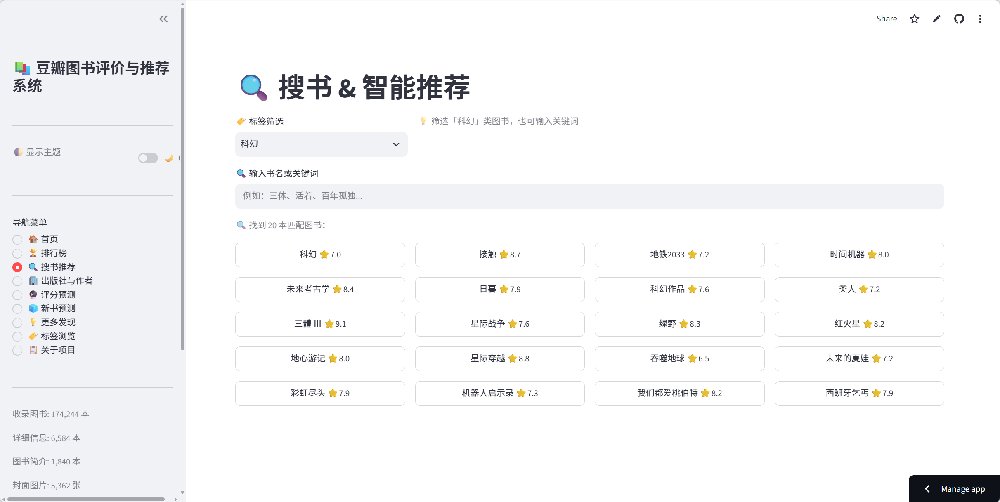
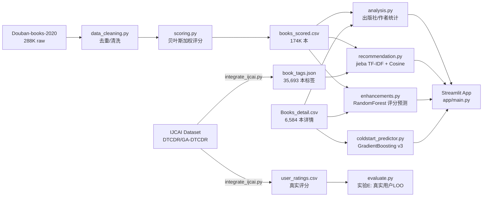

# 豆瓣图书评价与推荐系统 / Douban Book Recommender

> 基于 174,244 本豆瓣图书数据的智能推荐与评分预测系统 —— 江南大学大学生创新训练计划项目

**在线 Demo**: [xiaowanghold-bot-douban-book-recommender](https://xiaowanghold-bot-douban-book-recommender-appmain-epob3s.streamlit.app)




---

## 功能列表 / Features

9 个页面，与 app/main.py 一一对应：

| 页面 | 功能 |
|------|------|
| 首页 | 统计概览、精选高分图书卡片、快速导航 |
| 排行榜 | 贝叶斯加权评分排名，按评价人数分档筛选 |
| 搜书推荐 | 关键词搜索 + 真实豆瓣标签筛选 + 语义相似推荐 |
| 出版社与作者 | 贝叶斯收缩排名、二维气泡图、年份趋势 |
| 评分预测 | RandomForest 训练特征预测豆瓣评分 |
| 新书预测 | GradientBoosting 冷启动预测，输入书籍属性即可 |
| 更多发现 | 词云、价格分析、趋势洞察 |
| 标签浏览 | 基于真实豆瓣用户标签 + 语义搜索的流派图书探索 |
| 关于项目 | 数据来源、引用、技术栈说明 |

---

## 系统架构 / Architecture



---

## 评估结果 / Evaluation

所有数字来自 reports/evaluation_results.md，均为独立测试集结果。

### 1. 推荐引擎：字符 n-gram vs 语义化 TF-IDF

| 实验 | 指标 | 字符版 | 语义版 | 提升 |
|------|------|--------|--------|------|
| A: 同系列 Recall | Recall@10 | 0.1609 | **0.3627** | +125% |
| A: 同系列 Recall | Recall@20 | 0.1764 | **0.4144** | +135% |
| E: 真实用户 LOO | Recall@10 | 0.0038 | **0.0100** | +163% |
| E: 真实用户 LOO | Recall@20 | 0.0094 | **0.0206** | +119% |

> 局限性说明：实验A（同系列）对两种引擎均存在系列偏向——字符版靠书名重叠，语义版靠共享作者名与标签，因此系列 Recall 会高估实际推荐能力，需结合实验E的真实用户指标综合判断。实验E受限于 IJCAI 数据集覆盖范围（1,603 名用户，>=10 条评分且>=5 本高分在推荐索引内），样本量有限。

### 2. 评分预测：LabelEncoder 缺陷发现 -> train-only 均值特征修复

问题发现：原版使用 LabelEncoder 编码 author/publisher（高基数类别的任意整数编码，近乎噪声），导致 RandomForest 输给作者均值基线。

**修复前（LabelEncoder）**：

| 方法 | RMSE | MAE |
|------|------|------|
| 全局均值基线 | 0.7115 | 0.5723 |
| 出版社均值基线 | 0.6588 | 0.5262 |
| 作者均值基线 | 0.5987 | 0.4553 |
| RandomForest (LabelEncoder) | 0.6154 | 0.4890 |

> RF 输给作者均值基线

**修复后（train-only 统计均值）**：

| 方法 | RMSE | MAE |
|------|------|------|
| 全局均值基线 | 0.7115 | 0.5723 |
| 出版社均值基线 | 0.6588 | 0.5262 |
| 作者均值基线 | 0.5987 | 0.4553 |
| RandomForest (修复后) | 0.5457 | 0.4120 |

> 修复后 RMSE 反超作者均值基线 0.599，证明模型学到了超出简单统计量的信息。

### 3. 冷启动预测：双重泄露自查 -> v3 修正

问题发现：(a) votes_log 特征——真正的新书 votes=0，训练时不该见到此特征；(b) author_avg_rating/pub_avg_rating 等统计特征包含了目标书本身（数据泄露）——统计特征含自身才是泄露主体，去 votes_log 影响甚微。

| 版本 | R-squared（测试集） | 说明 |
|------|------|------|
| 作者均值基线（无模型） | 0.38 | 直接输出作者均分 |
| v1 原始 11 特征 | 0.81 | 虚高，含泄露 |
| v2 去 votes_log（10特征） | 0.80 | 去votes_log影响甚微，统计泄露仍在 |
| **v3 去 votes_log + LOO统计（线上部署版）** | **0.50** | 诚实估计，仍显著优于基线 |

> 线上部署即 v3，侧边栏指标为真实测试集 R-squared=0.50。

---

## 数据质量工程 / Data Quality

- **多版本去重**：dedup_editions() 规范化书名（去标点/空格/全半角/卷册后缀）后按作者分组留 votes 最高版本。例：《深入理解计算机系统》两版归一。
- **名称归一**：normalize_publisher()/normalize_author() 处理繁简体、合并条目拆分、后缀剥离、30 余个变体归一。例：「東立」+「東立出版社」+「東立出版社有限公司」-> 東立出版社 44本；「钱钟书」+「钱锺书」-> 钱锺书 16本。
- **贝叶斯收缩**：排行榜、出版社榜、作者榜统一使用贝叶斯收缩（m=P75=8.0，C=8.16；归一化后共492家出版社，统计与榜单纳入其中图书数>=3的214家；作者归一化后2,842位，纳入>=2的886位）。例：北京体育大学出版社（n=1/均分9.90）原始第1位 → 收缩后第58位；中华书局（n=35/均分8.99）原始第62位 → 收缩后第1位。

---

## 本地运行 / Local Setup

```bash
# 环境
pip install -r requirements.txt

# 模型产物生成（按顺序）
python -m src.data_cleaning      # 数据清洗 -> books_cleaned.csv
python -m src.scoring             # 贝叶斯加权 -> books_scored.csv
python -m src.analysis            # 出版社/作者统计
python -m src.recommendation      # jieba TF-IDF 向量 + NN 索引
python -m src.enhancements        # 词云/价格/评分预测模型
python -m src.coldstart_predictor # 冷启动预测模型

# 启动应用
streamlit run app/main.py

# 测试
pytest tests/ -v
```

---

## 数据来源 / Data Sources

| 数据集 | 规模 | 用途 | 来源 |
|------|------|------|------|
| Douban-books-2020 | 288,824 本 | 主数据集（评分/书名/作者） | [yuzhounh/Douban-books-2020](https://github.com/yuzhounh/Douban-books-2020) |
| IJCAI (DTCDR/GA-DTCDR) | 95,872 本 / 227K 条评分 | 标签映射 + 真实用户评估 | Kaggle |
| Books_detail.csv | 6,584 本详情 | 价格/页数/ISBN/装帧 | 自建爬虫 |
| book_descriptions.json | 1,840 条简介 | 语义搜索文档 | 自建爬虫 |
| book_tags.json | 35,693 本标签 | 推荐特征 + 标签筛选 | IJCAI 聚合变换 |

> user_ratings.csv 由 src/integrate_ijcai.py 从 Kaggle 原始 IJCAI 数据集生成，需自行下载原始数据后运行脚本。

### 引用 / Citation

若使用 IJCAI 数据集部分，请引用：
- Zhu et al., "DTCDR: A Framework for Dual-Target Cross-Domain Recommendation", CIKM 2019
- Zhu et al., "GA-DTCDR: Graph Embeddings for Cross-Domain Recommendation", IJCAI 2020

**研究用途说明**：本项目仅将 IJCAI 数据集用于学术研究与教学演示，不作商业用途。原始数据集部分文件（user_ratings.csv）未入库，仅保留聚合变换产物（book_tags.json、tag_counts.csv）。

---

## data/models/ 说明

data/models/ 目录下为预计算产物，因 Streamlit Cloud 部署需要而入库：

| 文件 | 大小 | 生成脚本 |
|------|------|------|
| tfidf_matrix.npz | ~7.3 MB | src/recommendation.py |
| nn_neighbors.pkl | ~10 MB | src/recommendation.py |
| vectorizer.pkl | ~1.5 MB | src/recommendation.py |
| books_for_rec.csv | ~16 MB | src/recommendation.py |
| rating_predictor.pkl | ~5.2 MB | src/enhancements.py |
| coldstart_model*.joblib | ~1.1 MB (3 files) | src/coldstart_predictor.py |

> nn_neighbors.npz（~80 MB，仅离线评估使用）不入库，运行 python -m src.recommendation 生成。若更改特征工程或训练数据，需重新运行对应脚本生成新产物。
---

## 未来工作 / Future Work

- 基于 IJCAI 评分数据的 item-based 协同过滤对比实验
- 图书简介覆盖扩展（当前 1,840 条，目标 30,000）
- CI 自动化（pytest + ruff 提交前检查）
- 基于标签的个性化推荐策略

---

## 技术栈 / Tech Stack

Python 3.12 . Streamlit . scikit-learn . jieba . pandas . plotly . matplotlib . wordcloud